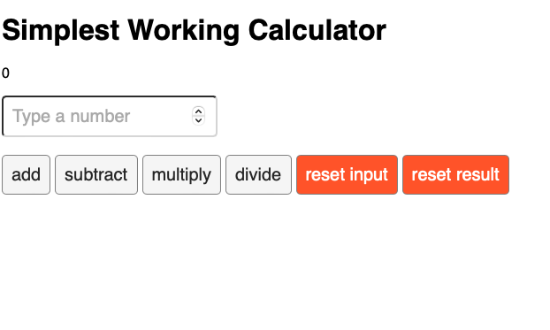

# Calculator-App

Simplest Working Calculator — a minimal React app that demonstrates basic arithmetic: add, subtract, multiply and divide.



## About
This is a demo project from a Meta React course.

## Features
- Add, subtract, multiply, divide on a running total
- Reset input or reset result
- Built with Create React App (`react-scripts`)

## Run locally

1. Install Node (LTS) and npm. Recommended: `nvm install --lts`.
2. From the project root:

```bash
cd /Users/muhammadmagdy/Desktop/Calculator-app
npm install
npm start
```

This starts the development server at http://localhost:3000.

## Scripts
- `npm start` — start dev server
- `npm run build` — production build
- `npm test` — run tests

## License
MIT
